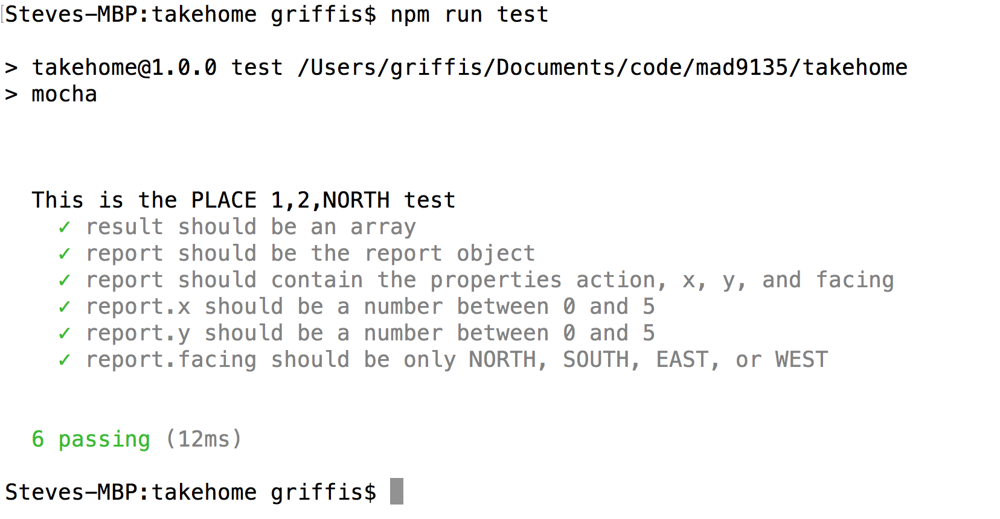

# Assignments

::: tip Prerequisite
You will need your [GitHub account](https://github.com) for most assignments. They will have related repositories to be retreived from and submitted to our [GitHub Classroom](https://classroom.github.com/).
:::


## Hybrid Assignments <Badge text="30%"/>

### Make Your Project Babel

- Create a new project folder
- initialize the folder as an NPM project [How to NPM](https://www.youtube.com/watch?v=_LqgURg3BXw)
- initialize the folder as a Git Repo [How to Git](https://www.youtube.com/watch?v=EdEWigP6zxQ)
- add a `.gitignore` file to ignore node_modules
- Create a **PRIVATE** Repo on GitHub with the same name.
- Use NPM to add Babel to the project [How to Babel](https://www.youtube.com/watch?v=ahh65GQz74g)
- Add a main.js file to the project
- Add an index.html file to the project with a script tag pointing to main.js
- Write some Javascript in your main.js file that runs after the DOMContentLoaded event.
- Your script can do anything you want but it must use at least these features:
```
async function with await
es6 method shorthand in objects
Object Destructuring
fetch
```

- **RUN THE BABEL SCRIPT ON YOUR PROJECT BEFORE SUBMITTING**
- Push the Repo up to GitHub using Git in the Terminal
- Submit the URL to the Brightspace assignment
- Invite `griffis@algonquincollege.com ` to your private repo.
- Due Friday Sept 21 @5pm

### Firebase Firestore App


- Start with this [PluralSight Tutorial](https://app.pluralsight.com/library/courses/firebase-firestore-getting-started/table-of-contents)
- Watch the Firebase Firestore tutorial at ~1.5x speed and you will be finished in less than an hour.
- Your assignment is to create your own simple website that lets you manage a list of your favourite categorized whatever.
- You write the HTML, CSS, and Javascript for the webpage.
- It needs to include an Unordered list of categories. 
- Inside each category there will be a list of items
    
```html
<!-- this is just an example list -->
<ul class="categories">
    <li>Cheese
    <ul>
        <li>Emmenthal</li>
        <li>Mozzarella</li>
        <li>Gouda</li>
    </ul></li>
    <li>Beer
    <ul>
        <li>Corona</li>
        <li>Headstock</li>
        <li>Heineken</li>
    </ul></li>
    <li>Burger Joints
    <ul>
        <li>Five Guys</li>
        <li>The Burger&apos; Priest</li>
    </ul></li>
</ul>
```

- Use Firebase Firestore to manage the data on your page.
- There will need to be a Form on the page for managing the categories 
- There will need to be a second form for adding an item to a category.
- The layout and design are up to you.
- Create a private repo on GitHub.
- Be sure to create a GitHub Pages branch
- Invite Steve to your private repo
- Submit a zipped copy of your Repo master branch on Brightspace
- In the comments, add the github.io URL for your site.
- Due Tuesday October 9th @5pm.

### Mocha and Chai

- After reading the content and watching the video tutorial on JavaScript Unit Testing with Mocha and Chai on this page [What is Mocha?](../modules/week6/mocha.md) 
- You will write a test to work for the robot.js script [zip](../robots.zip)
    - **STEPS**
    1. Create a project folder and add robot.js to that folder.
    2. Inside the project folder create a folder called "test". 
    3. Add the starter file robotTest.js inside the test folder. [zip](/mad9135/robots.zip)
    4. Initialize your package.json file with npm and set the test to run "mocha || true"
    5. Use `npm` to `install` and `--save-dev` for mocha and chai (or `yarn add`)
    6. Follow the instructions inside testRobot.js to create the 6 tests for Robot.js
    7. Run your scripts in the terminal with `npm run test`
- **SUBMISSION**
- After all your tests work, submit a zipped copy of your project folder.
- Compare the output from your test with this image. Your results should be similar to this.

- Due Oct 19, 2018 @5pm.

### Webpack

- 

### Hybrid 5


## Assignments <Badge text="30%"/>

### Your List of Favourite Things

- Create a single-page React App that allows CRUD operations on a List of things. 
- Each thing in the list needs an id, and, at least, two other bits of information.
- The list needs to be saved in the state belonging to the top level App Component.
- Inside the App component you need a `<Header>`, an `<AddForm />`, a `<ListContainer />` and a component for each `<Item />` in the list.
- See this screen capture for the basic idea of the functionality.
- 
- The finished assignment needs to be submitted as a private repo. 
- Invite Steve to your repo as a collaborator.
- Submit the URL of your repo to the assignment folder in Brightspace when you are finished.
- Due Wed Oct 17, 2018 @ 11:59pm

### Another Assignment


## Projects <Badge text="40%"/>

### React Project

- This project builds on the concepts from the "Favourite Things" assignment.
- It adds Routing and the ability to use `fetch()` to retrieve data from a server.


### React Native Project
