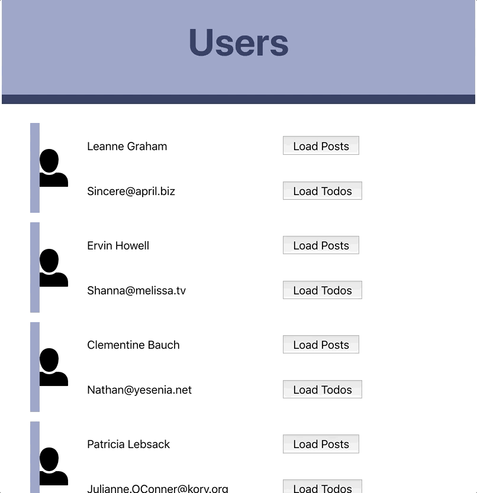

# Assignments

::: tip Prerequisite
You will need your [GitHub account](https://github.com) for most assignments. They will have related repositories to be retreived from and submitted to our [GitHub Classroom](https://classroom.github.com/).
:::


## Hybrid Assignments <Badge text="30%"/>

### Make Your Project Babel

- Create a new project folder
- initialize the folder as an NPM project [How to NPM](https://www.youtube.com/watch?v=_LqgURg3BXw)
- initialize the folder as a Git Repo [How to Git](https://www.youtube.com/watch?v=EdEWigP6zxQ)
- add a `.gitignore` file to ignore node_modules
- Create a **PRIVATE** Repo on GitHub with the same name.
- Use NPM to add Babel to the project [How to Babel](https://www.youtube.com/watch?v=ahh65GQz74g)
- Add a main.js file to the project
- Add an index.html file to the project with a script tag pointing to main.js
- Write some Javascript in your main.js file that runs after the DOMContentLoaded event.
- Your script can do anything you want but it must use at least these features:
```
async function with await
es6 method shorthand in objects
Object Destructuring
fetch
```

- **RUN THE BABEL SCRIPT ON YOUR PROJECT BEFORE SUBMITTING**
- Push the Repo up to GitHub using Git in the Terminal
- Submit the URL to the Brightspace assignment
- Invite `griffis@algonquincollege.com ` to your private repo.
- Due Friday Sept 21 @5pm

### Firebase Firestore App


- Start with this [PluralSight Tutorial](https://app.pluralsight.com/library/courses/firebase-firestore-getting-started/table-of-contents)
- Watch the Firebase Firestore tutorial at ~1.5x speed and you will be finished in less than an hour.
- Your assignment is to create your own simple website that lets you manage a list of your favourite categorized whatever.
- You write the HTML, CSS, and Javascript for the webpage.
- It needs to include an Unordered list of categories. 
- Inside each category there will be a list of items
    
```html
<!-- this is just an example list -->
<ul class="categories">
    <li>Cheese
    <ul>
        <li>Emmenthal</li>
        <li>Mozzarella</li>
        <li>Gouda</li>
    </ul></li>
    <li>Beer
    <ul>
        <li>Corona</li>
        <li>Headstock</li>
        <li>Heineken</li>
    </ul></li>
    <li>Burger Joints
    <ul>
        <li>Five Guys</li>
        <li>The Burger&apos; Priest</li>
    </ul></li>
</ul>
```

- Use Firebase Firestore to manage the data on your page.
- There will need to be a Form on the page for managing the categories 
- There will need to be a second form for adding an item to a category.
- The layout and design are up to you.
- Create a private repo on GitHub.
- Be sure to create a GitHub Pages branch
- Invite Steve to your private repo
- Submit a zipped copy of your Repo master branch on Brightspace
- In the comments, add the github.io URL for your site.
- Due Tuesday October 9th @5pm.

### Mocha and Chai

- After reading the content and watching the video tutorial on JavaScript Unit Testing with Mocha and Chai on this page [What is Mocha?](../modules/week6/mocha.md) 
- You will write a test to work for the robot.js script [zip](../robots.zip)
    - **STEPS**
    1. Create a project folder and add robot.js to that folder.
    2. Inside the project folder create a folder called "test". 
    3. Add the starter file robotTest.js inside the test folder. [zip](/mad9135/robots.zip)
    4. Initialize your package.json file with npm and set the test to run "mocha || true"
    5. Use `npm` to `install` and `--save-dev` for mocha and chai (or `yarn add`)
    6. Follow the instructions inside testRobot.js to create the 6 tests for Robot.js
    7. Run your scripts in the terminal with `npm run test`
- **SUBMISSION**
- After all your tests work, submit a zipped copy of your project folder.
- Compare the output from your test with this image. Your results should be similar to this.

- Due Oct 26, 2018 @5pm.

### Webpack

- Webpack is a great tool for carrying out routine tasks with your web projects. It allows you to manage packages that you need for development and distribution, it can process SASS, it can minify and concatenate CSS and JS files, as well as optimize images.
- This Hybrid requires you to follow along with the instructions in this tutorial
- [Tutorial web link](https://www.sitepoint.com/bundle-static-site-webpack/)
- It uses [this repo](https://github.com/sitepoint-editors/webpack-static-site-example) as the sample project.
- **Submission**
- Follow the instructions provided in the tutorial and then submit a zipped copy of your `dist` folder from the finished version of the tutorial.
- Please ALSO submit a copy of your `webpack.config.js` and `package.json` files.
- It is ok if you have to make multiple submissions OR you can combine the `webpack.config.js`, `package.json` and `dist` folder in the same zip file.
- Due Nov 9, 2018 5pm


### Hybrid 5

- Topic of your choice. Pick one from this list: 
    - **OAuth**: Build a sample React app that uses OAuth to allow a user to login with either Twitter or Facebook (you only have to implement one of the two) [oauth/react tutorial](https://www.youtube.com/watch?v=f5OLDvwP-Ug)
    - **Firebase**: Build a sample React app that uses Firebase to store data. The data should be fully editable (CRUD) from the React website.
    - **Redux**: Research and implement an updated version of your React Project that uses a Redux store to hold and maintain all the data. On the initial load do a fetch call to get all the users. Save the user data in the Redux store. As the user navigates to the different pages, check to see if the data is already in the store. If not, then do a fetch and save the new data in the store as well.
- Due by Dec 7, 2018 @5pm


## Assignments <Badge text="30%"/>

### Your List of Favourite Things

- Create a single-page React App that allows CRUD operations on a List of things. 
- Each thing in the list needs an id, and, at least, two other bits of information.
- The list needs to be saved in the state belonging to the top level App Component.
- Inside the App component you need a `<Header>`, an `<AddForm />`, a `<ListContainer />` and a component for each `<Item />` in the list.
- See this screen capture for the basic idea of the functionality.
- 
- The finished assignment needs to be submitted as a private repo. 
- Invite Steve to your repo as a collaborator.
- Submit the URL of your repo to the assignment folder in Brightspace when you are finished.
- Due Wed Oct 24, 2018 @ 11:59pm

### PWA Assignment

- Pick a partner in class who is someone that you do not normally work with. You will be doing Pairs Programming with person.
- Tell your instructor who your partner is.
- Create a SIMPLE offline-first PWA with your partner.
- Use the Google library [Workbox](https://developers.google.com/web/tools/workbox/guides/get-started) to create your app.
- Part of this assignment will be researching how to use WorkBox... hence the partner.
- You might want to use [LightHouse](https://developers.google.com/web/tools/lighthouse/) as a dev tool in Chrome when working with the PWA.
- The app needs to have:
    - A home page that the user needs to be connected to see
    - A home page that is displayed if the user is offline. This page will be loaded from the cache.
    - The offline page needs to have at least one image which is also cached.
    - Use a different image on the home page if the user is offline vs online.
    - All the offline files should be saved after installing the service worker.
    - If the app is online then it should fetch a JSON file from an API of your choice. Make sure that the data you are fetching will be different on a regular basis. Think of something like Weather data.
    - When the first call to the API is made, cache the response JSON file.
    - When the app is offline, use the cached version of the last JSON file fetched.
- Due Nov 28, 2018 @ 5pm


## Projects <Badge text="40%"/>

### React Project

- This project builds on the concepts from the "Favourite Things" assignment.
- It adds Routing and the ability to use `fetch()` to retrieve data from a server.
- Use the data from JSONPlaceHolder: [JSONplaceholder API docs](https://github.com/typicode/jsonplaceholder#available-resources)
- Your webpage should show a list of all the `users` on the home page.
- There needs to be a link from each displayed user for two other values for the selected user.
- Choose two from `ToDos`, `Posts`, `Albums`, `Photos`, or `Comments`
- There should be a top-level nav menu that lets the website user see all of the users or all of either of the two elements you choose.
- React Router should be used for all navigation.
- clicking the link from each user will show only the elements for that user.
- While data is being loaded in any component you should have a message/icon/indicator that data is loading. Animated is best because it gets the user's attention.
- 
- Create a Private Repo to hold your project.
- Invite Steve to the repo
- Submit the URL for your GitHub Pages version of the repo.
- Due Wed Nov 7, 2018 @ 11:59pm


### React Native Project

- For this project you will need to choose a different pairs programming partner than you had for your PWA assignment.
- Let your instructor know who your partner will be.
- The application, when opened, only displays a button for the user to click in order to download the list of restaurants nearby. 
- Your app can be either iOS or Android.
- Here is Yelp's [Mobile Style Guide](https://www.yelp.com/styleguide/mobile)
- Sample simple [version video of the app running](./final-mad9135.mov)
- The list is fetched from the [Yelp Fusion API](https://www.yelp.com/developers/documentation/v3/business_search) 
- In order to fetch those restaurants, you will need to create yourself an account and use the API key.  
- While the application is fetching that data, a spinner should be displayed, indicating to the user that something is happening.
- The search that you will implement will need to use the native GPS in order to provide a list to the user based on his coordinates.
- The list of restaurants will show the names as well as the distance displayed in kilometers (with 2 decimals) from where the user is located.  
- The list should be ordered by distance.
- Clicking on one of the list items should show the details for that place.  
- Information displayed should be at least: name, phone, distance, price and rating.
- Please format the information display and include an image inside the View.
- Here is Yelp's [Mobile Style Guide](https://www.yelp.com/styleguide/mobile)
- Here is Yelp's [Brand Guidelines and Logo Downloads](https://www.yelp.com/brand)
- Here are the page to download [the Yelp icons](https://www.yelp.com/styleguide/icons)
- Yelp [Colour Guide](https://www.yelp.com/styleguide/color)
- Yelp Stars [Image Downloads](https://www.yelp.com/developers/display_requirements)
- **Submission**
- Store your code in a PRIVATE repo. 
- Both people should be collaborators on the Repo.
- There should be commits on this project from BOTH partners
- Invite your instructor as a collaborator on the project too.
- Install your app on one of the phones in the cabinet
- Submit both the URL for your shared repo PLUS the name of the phone where your app is installed.
- Due Dec 12, 2018 @ 5pm
- NO LATE SUBMISSIONS as this is the end of the semester.
