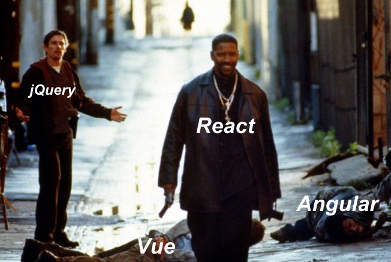

# Week 6: React Fragments, Refs, and Forms

## React Props and State

- props are for passing information from a parent component to a child
- state is for maintaining local data inside any component.
- There are places where you can't `setState()`. Like, the `render()`, `componentDidUpdate()`, `componentWillUpdate()`, `componentDidMount()`, or `shouldComponentUpdate()` method. Basically, set the initial value inside the `constructor()` and then only change it inside the methods that you build.
- Remember that the `constructor()` doesn't run on re-rendering of a component.
- Props can't be changed after they are passed.
- [React Props and State video](https://www.youtube.com/watch?v=2Ha_aAOfB4A)


## React Fragments

- Every return value from a `render()` method needs one root element
- In the DOM we have documentFragments to allow us to contain a peice of HTML that we want to render.
- DocumentFragments do not show up in the DOM after they have been added to the page.
- React has their own Component to create these.
- [React Fragments video](https://www.youtube.com/watch?v=_FwfdS568bY)

```javascript
render(){
    return (
        <React.Fragment>
            <p>React must be imported on the page to use these</p>
        </React.Fragment>
    );
}
```

## React Refs

- Refs are a way that you can reference an element inside your component.
- They exist because in React, you are not supposed to do anything to the DOM.
- Don't use `querySelector`, `querySelectorAll`, `getElementById`, etc.
- If you don't have an event listener on the element, and the content or properties of the element are not being driven by props or state, but you still need to access it, then REFS are the way to go.
- [React Refs video](https://www.youtube.com/watch?v=tsIZj0q1FlY)

```javascript
constructor(){
    super();
    this.myThing = React.createRef();
}

render(){
    return (
        <p><input type="text" ref={this.myThing} /></p>
    )
}
```





## React Form Elements

- Best practice with Forms is to use the `onSubmit` event.
- When your user is updating values inside your form elements, be reactive and use the `onChange` event to save what they are doing as they are doing it.
- [React Form video](https://www.youtube.com/watch?v=KRepX0_Ca_g)


## React conditional Rendering

- JavaScript uses logical short-circuiting to read expressions from left to right. 
- [Logical Short-Circuiting video](https://www.youtube.com/watch?v=MR0ohAODlOI)
- [Compound If statements video](https://www.youtube.com/watch?v=OLXyquuM05Q)
- If everything is expected to be true, then as soon as a false value is encountered nothing else will be processed.
- [Ternary Operator video](https://www.youtube.com/watch?v=_lEgIImHoM4)
- [JavaScript in Operator video](https://www.youtube.com/watch?v=HnD6aSu0ev0)
- We can use ternary operators in React, inside the render method to decide what we want to render.
- Alternatively we can use logical short-circuiting to create our Conditional Rendering.
- [Conditional Rendering in React](https://www.youtube.com/watch?v=96lj3ESW1es)


## What to do Before Week 7

- Watch the React Videos listed on this page
- [Week 6 Playlist](https://www.youtube.com/watch?v=2Ha_aAOfB4A&list=PLyuRouwmQCjkTsUOb3z_ZWsWuWeBmv2jH)